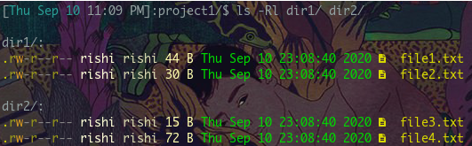
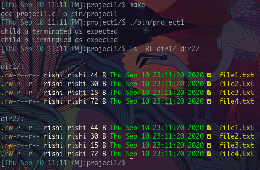

## Programming Assignment 1

# Precursor
This is an individual project and sharing of code is strictly prohibited. You (yes you, reading the README) are not permitted to copy this code with the intent to submit it as your own work. 

# Introduction
In this project I used ordinary pipes to implement an inter-process communication scheme for message passing between processes. I assumed that there are two directories (here they are `dir1 `and `dir2`), and different files in each one of them, and that each file contains a short-length string of characters, or multiple lines of characters. I used a parent process to call for two child processes, and had each child process check one of the directories
* child A (child B) is responsible to check `dir1` (`dir2`, respectively). This child process creates a list of names of the files in the directory and their contents. This is done through a system call, `tail -vn +1 *`, in the appropriate directory. 
* After creating the list, each child process sends its list to the other child process using a pipe. This is actually done during the creation of the list as I redirect stdout into the write end of a pipe before the system call
* Upon receiving thte listt, child b (child a) will create the files listed by child a (child b) in `dir2` (`dir1` respectively) and filling the files with their initial contents

After these steps, `dir1` and `dir2` will be identical

# Running
Use the Makefile. Run `make`. This will create a binary `project1` in `bin/` that you can run with `./bin/project1`. Run `ls -Rl` before and after you run the program and compare. Note that if you want to run the program again, the directories will already be synchronized, so you should do `make clean`.

# Screenshots
Here's the directories and the contents of their files before running the program: 

And here's those afterwards:

