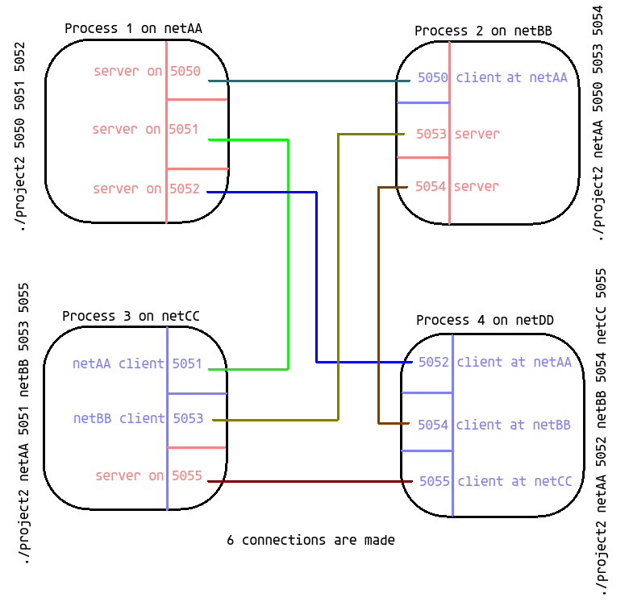

## Programming Assignment 2

# Precursor
This is an individual project and sharing of code is strictly prohibited. You (yes you, reading the README) are not permitted to copy this code with the intent to submit it as your own work. 

# Introduction
In this project I used sockets and threads to implement an inter-process communication scheme for message passing between 4 processes. There are four processes in the network, and each process is run on a separate machine. The goal is to create reliable socket connections (TCP) between each pair of processes, where each process listens for incoming messages from other nodes and sends input from the user to the other processes. I used threads to guarantee responsiveness with respect to user input. A process has separate threads for listening to each peer, and a fourth thread for user input. There are 3 types of inputs from the user
  
* **Send message to another process** The following command should send a message to the specified process: `send recvr_id MESSAGE` this will send `MESSAGE` to process `recvr_id`(bounded from 1 to 4)
* **Send message to all processes** The following command should send a message to all the other three processes: `send 0 MESSAGE`this will send `MESSAGE` to the other 3 processes
* **Stop** sends a `Stop` message to all other processes and marks own state as *stopped*. A *stopped* process can receive messages (and print them to the screen) but cannot send any more messages. When a processing has received `Stop` from the 3 other processes and is also `stopped`, then the process closes all of its socket connections, collects threads and exits gracefully

# Running
Use the Makefile, this will generate a `project2` exectuble at `bin/project2`. From here run 4 instances of the program, either use 4 terminal emulators or a program like `tmux`. For running on 4 `netXX` machines, here is an example of how to run the program

Process 1  `you@netAA > ./project2 5050 5051 5052`

Process 2 `you@netBB > ./project2 netAA.utdallas.edu 5050 5053 5054`

Process 3 `you@netCC > ./project2 netAA.utdallas.edu 5051 netBB.utdallas.edu 5053 5055`

Process 4 `you@netCC > ./project2 netAA.utdallas.edu 5052 netBB.utdallas.edu 5054 netCC.utdallas.edu 5055`

To run on a local machine, replace all `netXX.utdallas.edu` addresses with `localhost`. This is what the connections look like:

# Video?
I don't know if I'll upload a video, but here is a screenshot of the program running on 4 `netXX` machines. The order may be a little hard to figure out, lines preceded by `process #:` are printing what was sent to the running process, and lines with `send` and `Stop` were typed into that terminal and sent out.

