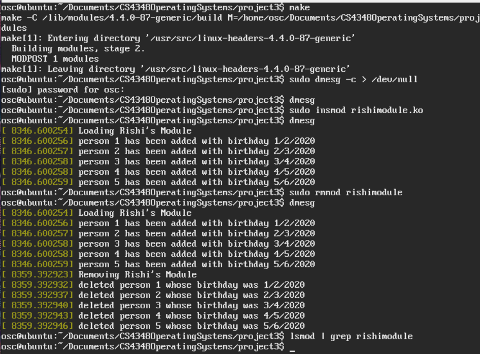

## Programming Assignment 3

# Precursor
This is an individual project and sharing of code is strictly prohibited. You (yes you, reading the README) are not permitted to copy this code with the intent to submit it as your own work. 

# Introduction
In Part 1 of this project I create a kernel module, then load and unload it. The kernel module will use `printk()` statements to add messages to the kernel log buffer that cana be checked with `dmesg`

In Part 2 of this project I  modify the entry and exit points of a kernel module to use elements of the linux header  `list.h` that implements a simple doubly linked list. 

* In the entry point,  I create a linked list with five `struct birthday` type elements, and traverse the list while outputting its contents to the kernel log buffer. This can be checked with `dmesg` once the module is loaded.  
* In the exit point, I delete the elements from the linked list and return the free memory back to the kernel. This can be checked with `dmesg` after the kernel module is unloaded

Below is still project 2...
# Running
Use the Makefile, this will generate a `rishimodule.ko` file (along with other object and kernel module files) that can be loaded. Since this project will be printing to the kernel buffer, you may find it helpful to clear the buffer with `sudo dmesg -c` but this is not necessary.

1. Look at the latest entries in the kernel buffer with `dmesg | tail -15` 

2. Load the module with `sudo insmod rishimodule.ko` and view the changes by looking at `dmesg | tail -15` again

3. Remove the module with `sudo rmmod rishimodule` and view the final changes by looking at `dmesg | tail -15` again

4. (optional) Verify that the module has been removed with `lsmod | grep rishimodule` and confirming that there are no matching modules

# Screenshot
Here is a screenshot of running the project on the OSCE Virtual Machine included with the book:

