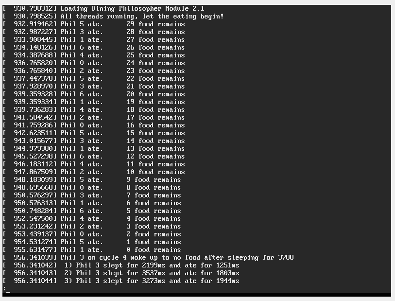
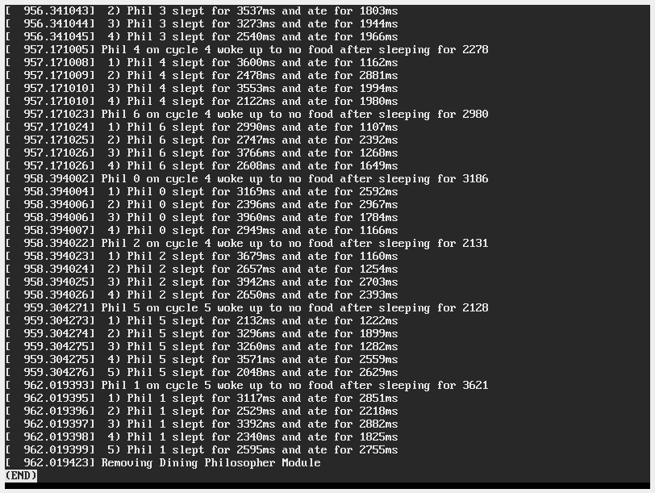

## Programming Assignment 4

# Precursor
This is an individual project and sharing of code is strictly prohibited. You (yes you, reading the README) are not permitted to copy this code with the intent to submit it as your own work. 

# Introduction
This project uses kernel modules to implement an asymmetrical solution for the dining philosopher problem. It uses kthreads and binary linux kernel semaphores.  

* The number of philosophers and forks is seven. I create seven kthreads when the module is loaded, one for each philosopher, and they operate on 8 binary semaphores. One for the shared food variable, and one for each fork. 
* The initial amount of food that is available is 30 units.
* All philosopher threads should be running before any of them starts trying to eat
* The philosopher thread works as follows:
	1. The philosopher sleeps for a random amount of time between 2 and 4 seconds
	2. The philosopher tries to acquire the two forks on either side.
	3. Upon acquiring the forks, the philosopher first checks the remaining amount of shared resource.
		- If the amount is more than 0:
			* The philosopher starts to eat: The amount of shared resource is decreased by 1 unit,  and,  the philosopher’s thread sleeps for a random amount of time between 1 and 3 seconds.
			* The philosopher releases the forks and goes to step 1.
		- If the amount is 0,
			* The philosopher thread logs/prints **the time spent before getting hungry** (the sleep time before acquiring forks) and the **time spent eating** (the sleep time after acquiring forks) for each eating cycle it had. Then, its thread terminates.

# Running
Use the Makefile, this will generate a `project4.ko` file (along with other object and kernel module files) that can be loaded. Since this project will be printing to the kernel buffer, you may find it helpful to clear the buffer with `sudo dmesg -c` but this is not necessary.

1. Look at the latest entries in the kernel buffer with `dmesg | tail -30` 

2. Load the module with `sudo insmod project4.ko`. The threads will start to run. Check the latest entries in the kernel buffer to watch the most recent changes as the program runs with `watch "dmesg | tail -30"`.

3. Remove the module with `sudo rmmod project4` and view the final output by looking at `dmesg | less`. 

4. (optional) Verify that the module has been removed with `lsmod | grep project4` and confirming that there are no matching modules

# Screenshot
A screenshot of running the project on the OSCE Virtual Machine included with the book is below. Additionally, a raw text file with the output of one run can be found [here](./samplelog.txt)	:

